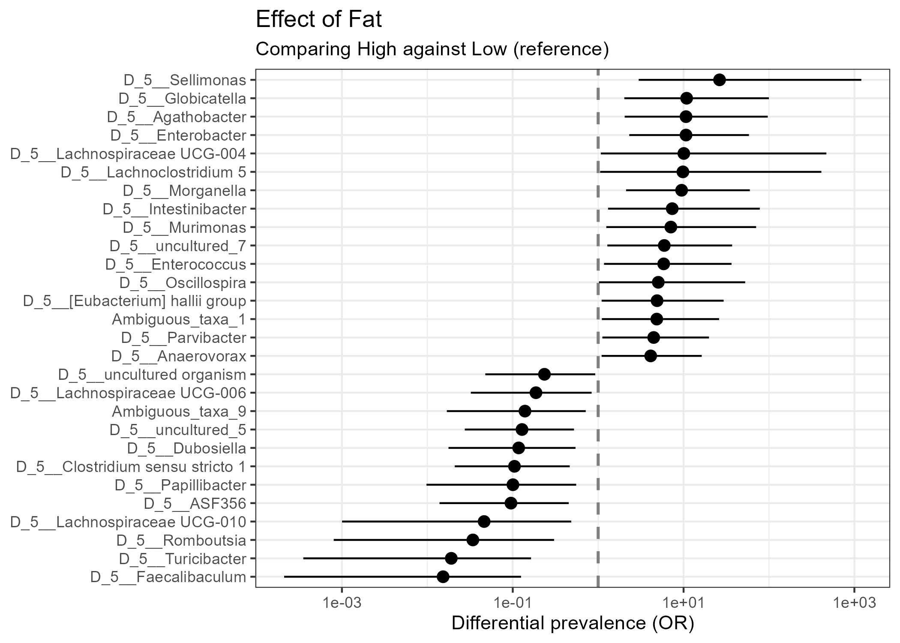
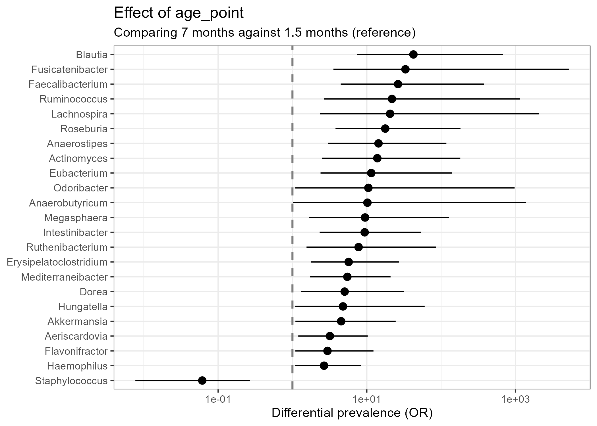

# DiPPER

This is an R package implementing DiPPER (**Di**fferential **P**revalence via
**P**robabilistic **E**stimation in **R**).

DiPPER is a Bayesian hierarchical model-based approach designed for differential
prevalence analysis, particularly in microbiome studies.

A pre-print of the paper introducing DiPPER can be found
[here](https://arxiv.org/abs/2602.05938).

## Advantages of DiPPER

* **Inherent multiplicity adjustment:** DiPPER provides differential
  prevalence estimates and uncertainty intervals that are naturally and
  automatically adjusted for multiple testing through hierarchical shrinkage.
  Differentially prevalent taxa can thus be detected without any post-hoc
  multiplicity adjustments.
* **Robust in boundary cases:** DiPPER produces finite differential prevalence
  estimates and uncertainty intervals even in boundary cases (e.g., when a taxon
  is completely absent or fully present in one study group) where some
  standard approaches fail.
* **Longitudinal data support:** DiPPER can handle longitudinal (or
  repeated measures) data by including random intercepts in the model.


## Installation

**1. Install the CmdStan backend**

As DiPPER relies on CmdStan software for Bayesian inference you first need to
install the `cmdstanr` package and configure the C++ toolchain.

```r
# Install cmdstanr from the official stan-dev repository
install.packages("cmdstanr",
                 repos = c("https://stan-dev.r-universe.dev",
                           getOption("repos")))

# Set up the C++ toolchain (Windows users may be prompted to install Rtools)
cmdstanr::check_cmdstan_toolchain(fix = TRUE)

# Install the actual CmdStan backend (only needs to be done once)
cmdstanr::install_cmdstan()
```

**2. Install DiPPER**

Once CmdStan is ready, you can install the development version of DiPPER. 
Using `BiocManager` for the installation automatically installs also all
required Bioconductor dependencies.

```r
# Install BiocManager if it is not already installed
if (!requireNamespace("BiocManager", quietly = TRUE)) {
    install.packages("BiocManager")
}

# Install DiPPER from GitHub
BiocManager::install("jepelt/DiPPER")
```

## Example Usage

### Example 1 (Basic cross-sectional setting)

Below is a simple example workflow using the built-in dataset, which compares
gut microbiomes of rats on a high-fat versus low-fat diet (N = 20 + 20) while
controlling for xylo-oligosaccharide supplementation. The dataset originates 
from [Hintikka et al. (2021)](https://www.mdpi.com/1660-4601/18/8/4049).

```r
library(DiPPER)

# Load dataset, provided as a SummarizedExperiment object, and agglomerated to 
# genus level.
data("tse_hintikka")

# Run DiPPER.
# The first term in the formula (here: Fat) is automatically used as the
# variable of interest. XOS (xylo-oligosaccharide supplementation) is included
# as a covariate. The name of the assay (here: 'counts') must also be provided.
#
# Note: When using DiPPER for the first time, compiling the Stan model may
# take around one minute and produce verbose C++ output. This is expected.
fit <- dipper(
    tse = tse_hintikka,
    formula = ~ Fat + XOS,
    assay.type = "counts",
    niter = 400 # This needs to be increased in practice!
)

# Extract summarized results as a data.frame
res <- summary(fit)

# Create a forest plot (showing only 'significant' taxa)
# It can be seen how, for instance, Sellimonas genus has higher prevalence in
# High fat group (vs. Low fat group), while Faecalibaculum genus has higher 
# prevalence in Low fat group.
plot(fit)
```



### Example 2 (Longitudinal setting)

This example demonstrates how to run DiPPER on repeated measures data by
including a random intercept for the subject. We use a built-in subset of
the [Vatanen et al. (2016)](https://pmc.ncbi.nlm.nih.gov/articles/PMC4950857/)
dataset. The dataset includes gut microbiome samples from 79 infants at one 
or two time points (1.5 and/or 7 months of age).

The abundance data are provided as relative abundances (proportions), and
thus we cannot control for sequencing depth now.

```r
library(DiPPER)

# Load dataset, provided as a SummarizedExperiment object, and agglomerated to 
# genus level.
data("VatanenT_2016_subset")

# The metadata includes variables subject_id (indicating infant), age_point (in
# months), antibiotics (use of antibiotics: yes/no) and gender (male/female).
VatanenT_2016_subset |>
    SummarizedExperiment::colData() |>
    head()
    
## DataFrame with 6 rows and 4 columns
##        subject_id antibiotics  age_point   gender
##          <factor>    <factor>   <factor> <factor>
## G80490    E002338         no  1.5 months   female
## G80455    E002473         no  7 months     female
## G80498    E002473         no  1.5 months   female
## G80621    E002681         yes 7 months     female
## G80522    E004781         no  1.5 months   female
## G80574    E004781         yes 7 months     female

# Run DiPPER.
# By putting age_point as the first variable of the formula it is automatically 
# set as the variable of interest. Gender and antibiotics use are controlled 
# for. Lastly, the longitudinality of the data is accounted for by specifying 
# subject_id as a random intercept term by writing (1 | subject_id).

# Note that because the abundance data are proportions, we must specify
# data.type = "relabundance" in addition to providing the assay name
# assay.type = "relative_abundance". Moreover, as we cannot now control for the
# sequencing depth, we must set read.depth = FALSE.
fit_long <- dipper(
    tse = VatanenT_2016_subset,
    formula = ~ age_point + antibiotics + gender + (1 | subject_id),
    assay.type = "relative_abundance",
    data.type = "relabundance",
    read.depth = FALSE,
    niter = 400 # This needs to be increased in practice!
)

# Extract the results for age_point 
res_long <- summary(fit_long)

# Create a forest plot (showing 'significant' taxa only)
# As expected, the prevalence of several taxa increases with infant age,
# although the prevalence of Staphylococcus decreases.
plot(fit_long)
```


